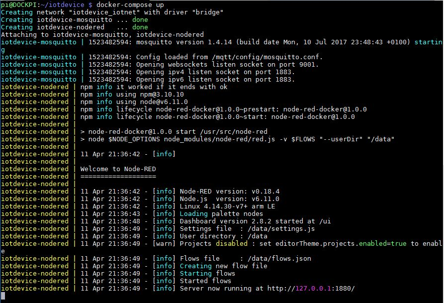

# Docker IoT Machine

We are a maker community in Karlskrona, Sweden. See our site for other ideas and activities: [Raspberry Valley](https://raspberry-valley.azurewebsites.net).

This Docker configuration creates an IoT Raspberry Pi device as a foundation for IoT development in our makerspace. Before using Docker, we configured our devices the hard way - see our original configuration here: [IoT Raspberry Pi Device](https://raspberry-valley.azurewebsites.net/IoT-Raspberry-Pi-Device/). The same can be achieved using [Docker](https://www.docker.com) and [Docker Compose](https://docs.docker.com/compose/), which is achieved in this project.

Read the documentation [here](https://raspberry-valley.azurewebsites.net/IoT-Raspberry-Pi-Device-on-Docker/)



The solution is targeted at a good Raspberry Pi experience. However we provide both Raspperry Pi images (custom developed for our use) and a PC solution (custom, for testing purposes).

You can find the related images here:

* [docker-nodered](https://github.com/raspberryvalley/docker-nodered)
* [docker-mosquitto](https://github.com/raspberryvalley/docker-mosquitto)

## Development version

We focus on our Raspberry Pi image. However you may want to test flows on your PC. For your convenience, we have added a docker-compose for PC debugging. This file uses standard images (instead of custom images we made for Raspberry Pi) and is purely intended for testing.

To run, simply navigate to the **iot-device** folder and run:

```bash
docker-compose up
```

Your test site is now available at:

```bash
http://localhost:1880
```

Once you're done, you can remove all traces of your tests (including containers) by using the 'down' command, as shown below. Please note, all traces of your work are lost! Next time you start from scratch.

```bash
docker-compose down
```

## Links

* [Docker IoT Machine - master documentation (Raspberry Valley)](https://raspberry-valley.azurewebsites.net/IoT-Raspberry-Pi-Device-on-Docker/)

Raspberry Valley makerspace links

* [Raspberry Valley](https://raspberry-valley.azurewebsites.net) - Other things we make and do
* [Raspberry Valley on Twitter](https://twitter.com/RaspberryValley)
* [Raspberry Valley on Github](https://github.com/raspberryvalley)
* [Raspberry Valley Docker Hub Images](hub.docker.com/r/raspberryvalley/)
